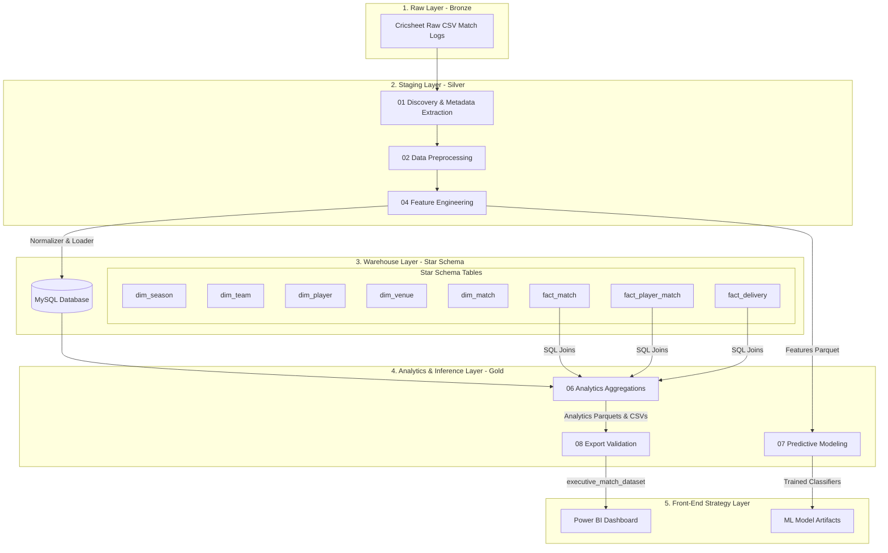

# 🏏 IPL Analytics & Strategy Platform

[](https://www.python.org/)
[](https://www.mysql.com/)
[](https://powerbi.microsoft.com/)
[](https://catboost.ai/)

An end-to-end Data Engineering, Data Science, and Business Intelligence platform built to analyze historical Indian Premier League (IPL) data (from 2008 to 2026). The platform ingests raw ball-by-ball datasets, standardizes and processes them into a normalized MySQL Data Warehouse (Star Schema), generates analytical marts (Gold Layer), trains multi-class machine learning models to predict match outcomes, and serves an executive Power BI Strategy Dashboard.

---

## 📌 Table of Contents
1. [Platform Architecture](#-platform-architecture)
2. [Project Directory Layout](#-project-directory-layout)
3. [Jupyter Notebook Pipeline (Phase-by-Phase)](#-jupyter-notebook-pipeline-phase-by-phase)
4. [Data Warehouse Star Schema Design](#-data-warehouse-star-schema-design)
5. [Machine Learning Modeling & Benchmarks](#-machine-learning-modeling--benchmarks)
6. [Power BI Strategy & Analytics Dashboard](#-power-bi-strategy--analytics-dashboard)
7. [Developer Setup & Quickstart](#-developer-setup--quickstart)
8. [Pipeline Workflows & Execution](#-pipeline-workflows--execution)

---

## 🏗️ Platform Architecture

The platform is designed around a modern multi-layer data lakehouse and warehouse pattern:
1. **Bronze Layer (Raw)**: Immutable, raw ball-by-ball match logs from Cricsheet.
2. **Silver Layer (Processed/Staging)**: Cleaned, normalized, and unified Parquet files.
3. **Warehouse Layer (Relational)**: A fully normalized **Star Schema** relational database housed in MySQL, complete with surrogate keys, referential integrity, and query-optimized database indexes.
4. **Gold Layer (Analytics Mart)**: High-performance aggregated metrics grouped by seasons, teams, venues, players, and head-to-head metrics.
5. **Inference & Strategy Layer**: 
   - Multi-model ML classification engine (CatBoost, XGBoost, etc.) predicting match winners.
   - Interactive Power BI Executive Strategy Dashboard consuming conformed analytics datasets.



---

## 📂 Project Directory Layout

```directory
IPL-Analytics-Strategy-Platform/
│
├── config/                  # Global platform settings & environment paths
│   ├── config.py            # Re-exports system-wide configurations
│   ├── paths.py             # Automatic project root detection & runtime path registration
│   └── settings.py          # MySQL credentials, log settings, and hyper-parameters
│
├── data/                    # Multilayer data repository (Ignored from Git except metadata)
│   ├── raw/                 # Raw Cricsheet match files (CSV format)
│   ├── processed/           
│   │   ├── staging/         # Intermediate Parquet files & discovery metadata reports
│   │   └── warehouse/       # Relational dimensions and facts (Parquet format)
│   └── analytics/           # Analytics mart datasets (CSVs and Parquet files)
│
├── notebooks/               # Step-by-step Jupyter Notebooks (01 to 08)
│   ├── 01_dataset_discovery.ipynb
│   ├── 02_data_preprocessing.ipynb
│   ├── 03_exploratory_analysis.ipynb
│   ├── 04_feature_engineering.ipynb
│   ├── 05_sql_pipeline.ipynb
│   ├── 06_analytics.ipynb
│   ├── 07_machine_learning.ipynb
│   └── 08_export_validation.ipynb
│
├── powerbi/                 # Power BI dashboards and executive data
│   ├── datasets/            # Flat CSV/Parquet files exported specifically for Power BI
│   └── pbix/                # IPL-Strategy & Analytics Power BI dashboard template
│
├── src/                     # Core Python Library Modules
│   ├── analytics/           # Season, team, venue, player, and H2H profiling engines
│   ├── data_access/         # Data loading and file management interfaces
│   ├── database/            # MySQL schema DDLs, loaders, connection handlers, and query catalogs
│   ├── etl/                 # Normalizers, feature builders, and CSV parsers
│   ├── ml/                  # ML training, preprocessing, evaluating, and inference code
│   ├── models/              # Dataclass definitions for release & pipeline objects
│   ├── validation/          # Project validation rules and quality control checkers
│   └── workflows/           # Orchestration pipelines (Database, ML, Analytics, Releases)
│
├── pyproject.toml           # Setuptools package configuration for local development
├── requirements.txt         # Clean, pinned dependencies from the active virtual env
└── LICENSE                  # MIT License
```

---

## 📓 Jupyter Notebook Pipeline (Phase-by-Phase)

The project executes through 8 structured notebooks, establishing a deterministic data lineage:

### [01. Dataset Discovery & Metadata Extraction](notebooks/01_dataset_discovery.ipynb)
- Performs file audit on raw CSVs.
- Extracts match dates, venues, cities, competing teams, and missing columns.
- Performs initial dataset profiling, cataloging match records, and outputting quality checklists.

### [02. Data Preprocessing](notebooks/02_data_preprocessing.ipynb)
- Unifies team names (e.g., standardizing historical franchise renames and casing differences, like mapping *Kings Xi Punjab* to *Kings XI Punjab*).
- Cleans and resolves stadium naming anomalies (e.g., merging spelling variations of venues like Bindra Stadium).
- Resolves data types and parses date formats, saving clean match records to the Staging area.

### [03. Exploratory Data Analysis & Analytics Engine](notebooks/03_exploratory_analysis.ipynb)
- Leverages the Python analytics package (`src.analytics`) to profile raw data.
- Creates visual charts in staging (`winning_margin_runs_dist.png`, `top_venues.png`, `matches_per_season.png`) and outputs an preliminary executive summary.

### [04. Feature Engineering Pipeline](notebooks/04_feature_engineering.ipynb)
- Aggregates ball-by-ball deliveries to build carrier and rolling statistics.
- Computes **batsman career metrics** (runs, strike rate, boundaries, dismissals) and **bowler career metrics** (wickets, economy, average, dot ball percentage).
- Evaluates venue features (average runs, boundary rates) and team form features to prepare the datasets for ML training.

### [05. SQL Pipeline & Data Warehouse Construction](notebooks/05_sql_pipeline.ipynb)
- Establishes a connection to the MySQL server.
- Executes the database pipeline to normalize cleaned datasets into a Relational **Star Schema**.
- Generates the physical database, builds tables, enforces primary/foreign key relationships, and populates data.

### [06. Analytics Framework](notebooks/06_analytics.ipynb)
- Queries the MySQL Relational Star Schema to compute high-performance aggregations.
- Generates localized tables (gold layer) grouped under seasons, teams, venues, players, and head-to-head records, saving them in Parquet and CSV formats.

### [07. Machine Learning Predictive Engine](notebooks/07_machine_learning.ipynb)
- Ingests the engineered feature sets from the staging layer.
- Builds preprocessing pipelines for category encoding and features scaling.
- Trains and benchmarks 6 classification models, saving performance statistics, confusion matrices, and feature importances.

### [08. Release Export & Validation](notebooks/08_export_validation.ipynb)
- Runs a comprehensive project validation checklist.
- Verifies parity between the MySQL database registers and the exported analytical Parquets.
- Packages final conformed deliverables into a deployment-ready `release/` directory.

---

## 🗄️ Data Warehouse Star Schema Design

To support low-latency analytical queries and simplify Power BI visualization joins, the database pipeline transforms the transactional data into a classic multidimensional Star Schema.

### Database Tables (MySQL)

#### Dimensions

| Dimension Table | Primary Key | Description | Key Attributes |
| :--- | :--- | :--- | :--- |
| **`dim_season`** | `season_key` | Calendar details of IPL seasons. | `season`, `season_start_date`, `season_end_date`, `total_matches` |
| **`dim_team`** | `team_key` | IPL franchises list. | `team_name`, `team_short_name`, `first_season`, `last_season` |
| **`dim_player`** | `player_key` | Registered players index. | `player_name`, `first_season`, `last_season` |
| **`dim_venue`** | `venue_key` | Stadium and location descriptors. | `venue`, `city`, `first_season`, `last_season` |
| **`dim_match`** | `match_key` | Match metadata catalog. | `match_id`, `match_date`, `toss_decision`, `win_type`, `win_margin`, `match_type` |

#### Fact Tables

| Fact Table | Keys | Description | Metric Measures |
| :--- | :--- | :--- | :--- |
| **`fact_match`** | `match_key` (PK/FK) | Aggregated match-level deliverables. | `total_runs`, `total_wickets`, `total_boundaries`, `total_fours`, `total_sixes`, `total_extras` |
| **`fact_player_match`** | `(match_key, player_key)` (PK/FK) | Individual player stats for a specific match. | `batting_runs`, `balls_faced`, `fours`, `sixes`, `dismissals` |
| **`fact_delivery`** | `(match_key, innings, over_number, ball_number)` (PK) | Detailed ball-by-ball record. | `runs_off_bat`, `extras`, `total_runs`, `is_boundary`, `is_four`, `is_six`, `is_dot_ball`, `is_wicket`, `is_legal_delivery` |

### Warehouse Optimization (Indexes)
To optimize complex join operations, the database pipeline automatically configures index structures on vital query paths:
- `idx_dim_match_season` ON `dim_match(season_key)`
- `idx_dim_match_team1` ON `dim_match(team1_key)`
- `idx_dim_match_team2` ON `dim_match(team2_key)`
- `idx_fact_delivery_match` ON `fact_delivery(match_key)`
- `idx_fact_delivery_batter` ON `fact_delivery(batter_key)`
- `idx_fact_delivery_bowler` ON `fact_delivery(bowler_key)`
- `idx_fact_player_match_player` ON `fact_player_match(player_key)`

---

## 🤖 Machine Learning Modeling & Benchmarks

The machine learning layer formulations focus on **predicting the match winner** before the first ball is bowled. The pipeline ingests pre-game features (participating teams, seasonal factors, venue, toss results) to classify the winning franchise.

### Model Performance Benchmark

The system pipelines preprocesses, trains, and validates six classification algorithms using 5-fold cross-validation. The performance results are detailed below:

| Classifier Key | Classifier Model | CV Accuracy (Mean) | CV Accuracy (Std) | Test Accuracy | Precision | Recall | F1 Score | Training Time |
| :--- | :--- | :---: | :---: | :---: | :---: | :---: | :---: | :---: |
| **`catboost`** | **CatBoost** | **50.83%** | **0.0205** | **53.28%** | **0.5235** | **0.5328** | **0.5197** | **5.09s** |
| `xgboost` | XGBoost | 50.21% | 0.0111 | 51.23% | 0.5074 | 0.5123 | 0.5056 | 0.69s |
| `lightgbm` | LightGBM | 51.85% | 0.0390 | 48.77% | 0.4766 | 0.4877 | 0.4797 | 2.37s |
| `random_forest` | Random Forest | 45.18% | 0.0136 | 48.77% | 0.4774 | 0.4877 | 0.4755 | 0.43s |
| `decision_tree` | Decision Tree | 39.12% | 0.0318 | 40.98% | 0.4118 | 0.4098 | 0.4065 | 0.01s |
| `logistic_regression`| Logistic Regression| 24.95% | 0.0127 | 27.05% | 0.2378 | 0.2705 | 0.2472 | 0.66s |

> [!NOTE]
> Predicting sports matches purely on pre-game parameters is highly complex. Given the multi-class team prediction nature (15+ historical teams), a baseline random guess has an accuracy of < 7%. The champion **CatBoost** model's test accuracy of **53.28%** represents a highly statistically significant predictive signal.

### Feature Importances

The CatBoost classifier evaluates the relative predictive weights of the pre-match input factors. Team identity combinations and temporal shifts dictate over 64% of match outcomes:

```mermaid
gantt
    title Feature Predictive Importance (%)
    dateFormat  X
    axisFormat %
    
    section Features
    team2 (Away Team)          :active, 0, 23
    team1 (Home Team)          :active, 0, 21
    season (Year/Team strength):active, 0, 20
    toss_winner (Toss advantage): 0, 12
    venue (Stadium dimensions) : 0, 10
    city (Environmental factors): 0, 9
    toss_decision (Bat/Bowl)   : 0, 5
```



- **Team 1 & Team 2 Identities (44% combined)**: The respective rosters, historical strengths, and team dynamics are the primary drivers of match outcomes.
- **Season/Year (20.4%)**: Captures temporal drift, representing cycles of franchise performance, rule changes (e.g., impact sub rules), and player acquisitions.
- **Toss Winner (11.7%)**: Confirms the strategic advantage of getting to choose game conditions based on pitch dynamics.

---

## 📊 Power BI Strategy & Analytics Dashboard

The platform builds a dedicated analytical dataset (`executive_match_dataset`) formatted for BI consumption. It consolidates match records, batting scores, and toss decisions into a flat structure.

### BI Dataset Schema (`executive_match_dataset`)
The conformed dataset exported in `powerbi/datasets/` contains:
- `match_id` (Unique match identifier)
- `season` (IPL Season Year)
- `match_date` (Date of play)
- `team1` / `team2` (Playing franchises)
- `team1_score` / `team2_score` (Innings aggregates)
- `winner` (Winning team)
- `win_type` (Runs, Wickets, Tie, or No Result)
- `win_margin` (Win margin size)
- `venue` / `city` (Location profiles)
- `toss_winner` / `toss_decision` (Toss details)
- `player_of_match` (Outstanding performance award recipient)
- `is_completed` (Boolean state flag)

### 📈 Strategic Power BI Layout
The `.pbix` template located in `powerbi/pbix/IPL-Strategy & Analytics.pbix` connects directly to these files to generate a dashboard with 4 strategic report views:
1. **Executive Scorecard**: High-level KPIs (Total matches, average runs per innings, boundary frequencies, and win-type splits).
2. **Franchise Analytics**: Detailed team summaries showing win rates (home vs. away), run rates, match outcomes, and historical trends.
3. **Venue Profiles**: Venue performance summaries mapping batting-first vs. bowling-first win percentages, average score distributions, and toss choices.
4. **Head-to-Head Strategizer**: Strategic tool enabling side-by-side comparison of two selected teams, listing match margins, match histories, and player impact awards.

---

## 💻 Developer Setup & Quickstart

### Prerequisites
- Python 3.9 or higher
- MySQL Server 8.0+
- Power BI Desktop (for dashboard exploration)

### 1. Clone the Project
```bash
git clone https://github.com/yourusername/IPL-Analytics-Strategy-Platform.git
cd IPL-Analytics-Strategy-Platform
```

### 2. Configure Virtual Environment
```powershell
# Create environment
python -m venv .venv

# Activate environment (Windows)
.venv\Scripts\activate

# Activate environment (macOS/Linux)
source .venv/bin/activate

# Install dependencies
pip install -r requirements.txt
pip install -e .
```

### 3. Setup Environment variables
Create a `.env` file in the root directory to store database connection details securely (or configure them in `config/settings.py`):
```env
MYSQL_HOST=127.0.0.1
MYSQL_PORT=3306
MYSQL_USER=root
MYSQL_PASSWORD=your_password
MYSQL_DATABASE=ipl_analytics
```

---

## ⚙️ Pipeline Workflows & Execution

The platform is designed to be executed either step-by-step using the Jupyter Notebooks inside `notebooks/` or programmatically via the orchestrated Python pipelines located in `src/workflows/`.

### Run Python Workflows

You can trigger the pipelines programmatically. Below is an example execution script:

```python
from src.workflows.database_pipeline import run_database_pipeline
from src.workflows.analytics_pipeline import run_analytics_pipeline
from src.workflows.ml_pipeline import run_ml_pipeline
from src.workflows.export_validation_pipeline import run_export_validation_pipeline
from config.config import STAGING_DIR

# 1. Build and Load MySQL Data Warehouse
db_result = run_database_pipeline(
    matches_path=str(STAGING_DIR / "match_info_processed.parquet"),
    deliveries_path=str(STAGING_DIR / "deliveries_processed.parquet")
)
print(f"DW Build Status: {db_result.status}")

# 2. Extract Analytics Mart (Gold Layer)
analytics_result = run_analytics_pipeline()
print("Analytics Mart tables updated successfully.")

# 3. Train ML Predictor (CatBoost)
ml_result = run_ml_pipeline(target_column="winner", model_name="catboost")
print(f"ML CatBoost Test Accuracy: {ml_result.evaluation_result.test_accuracy:.4f}")

# 4. Run Release Packaging & Validation
release_result = run_export_validation_pipeline()
print(f"Platform Release Status: {release_result.status}")
```

### Run Notebooks in Order
If you prefer running through the notebooks interactively:
1. Run `01_dataset_discovery.ipynb` to audit raw files.
2. Run `02_data_preprocessing.ipynb` to generate clean staging parquets.
3. Run `03_exploratory_analysis.ipynb` to view dataset charts.
4. Run `04_feature_engineering.ipynb` to build advanced batsman/bowler profiles.
5. Run `05_sql_pipeline.ipynb` to construct and seed the MySQL Warehouse.
6. Run `06_analytics.ipynb` to export conformed analytics tables.
7. Run `07_machine_learning.ipynb` to train predictive classifiers.
8. Run `08_export_validation.ipynb` to package the conformed dashboard datasets.

